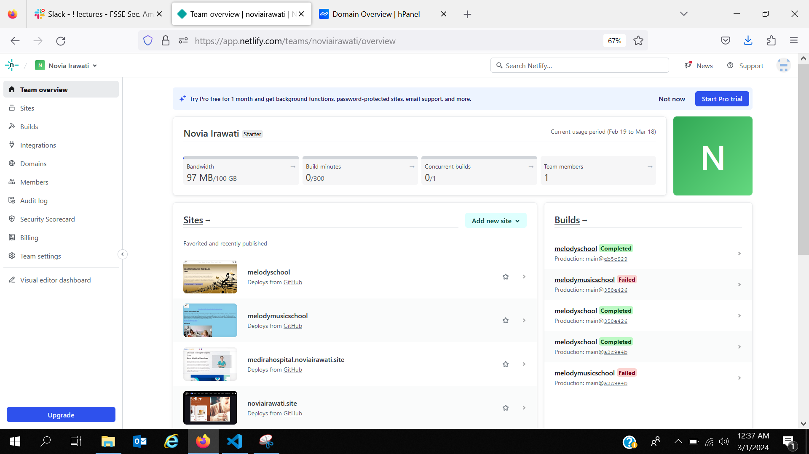

Hello, This assignment for week 4
Theme: "Melody Music Course"
I use HTML, CSS and Javascript to built the website.
HTML Version: HTML5

## Version Control
### Creating Branches
1. In any Git project, you can see all branches by writing the following command in the command line:
git branch

2. It's very easy to create a new branch, just write the following command in the command line:
git checkout "name of new Branch"

### Commiting Changes
git add <files>
git commit -m <message>

### Merging Code
git checkout other_branch
git cherry-pick changed_branch

### Table of Content:
1. HTML Semantic Structure
2. CSS File (style.css)
3. Javascript File (script.js)
4. Readme File for documentation (README.md)
5. Images File (IMG)

### I use semantic element:
1. Header
2. Main
3. Footer

### Source
1. [color hunt](https://colorhunt.co/)
2. [Free Pik](https://www.freepik.com)

## Deployment Process
There are few steps in Deployment Process Buy A Domain, Setting Up DNS and Make subdomain to Netlify.

### Process Buy A Domain

### Setting Up DNS
    1. Inside of the Netlify dashboard, navigate to your domain settings and click “Add Domain Management”

    2. Enter the name of your domain and click “Verify”.

    3. After that has finished, click on the options menu next to your new domain and choose “Set up Netlify DNS”.

    4. Follow the steps here by choosing “Verify”, then “Add Domain”, and “Continue”. Then when you get to the screen about domain name servers, copy those name servers.

    5. Then, in the dashboard where you bought your domain (mine is Namecheap), set the DNS to custom DNS and add the DNS names from Netlify.

    6. Then, in the dashboard where you bought your domain (Niaga Hoster), set the DNS to custom DNS and add the DNS names from Netlify > Click "Change" > and Then Click "Save"

    7. Click "Done" in Netlify

    8. After that, you may need to wait a few minutes for the settings to propogate, you should eventually see the “Netlify DNS” tag associated with your domain name.
    

### Auto Deployement on Github with Netlify

    1. Add New Site

    2. Link to Your GitHub (or supported version-control tool of choice), then Clicking "Import An Existing Project"

    3. Authorize Netlify It's time to authorized your Netlify and GitHub to connect each other. Clicking the "Authorized"

    4. Select Your Repo Now that you've connected Netlify and GitHub, you can see a list of your Git repos. Choose the repo you’d like to deploy from the list.
    

    5. Configure Your Settings click the "Deploying" button to continue.

    6. Build Your Site Now it's time to sit back and relax. You did your part; let Netlify take care of the rest. It'll only take a minute.

    7. All Done Once the build completes, your site is live! Head to the overview and you can see the URL of your newly published site.
    
    

8. Netlify automatically generated a name for your site. Let's update that by visiting the settings tab and clicking "Change site name":

Here's my deploy on Netlify:
[melody music course](melodymusiccourse.netlify.app)

### How to Make Subdomain
Now I want to create a subdomain with the results of deploying my project assignment.
1. Select the "domain" menu

2. Select "Add or Registered Domain"

3. Fill in the subdomain name and verify
